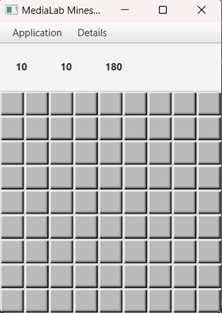
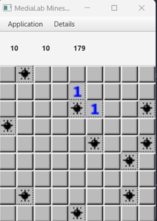
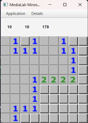
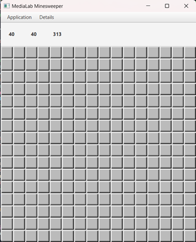

# Multimedia Technology - NTUA (2022-2023)

This repository hosts the semester project of the Multimedia Technology course held by ECE NTUA during the Winter 2022-2023.

--- 

## Minesweeper Game with Super Mine
This project is a Java implementation of the classic Minesweeper game, with the added feature of a "super mine".
>  If the player marks the square corresponding to the super-mine within the first 4 attempts, the application will reveal the contents of all squares that are in the same row and column as the super-mine. Where there are mines, they will be shown with a different marker and the player will no longer be able to select those squares.

## How to Play
To run the game, simply compile and run the Minesweeper.java file. 
* When launching the application through the IDE, a 'empty' window in which the user, through 𝑨𝒑𝒓𝒍𝒊𝒄𝒂𝒕𝒊𝒐𝒏, call to create a new game or even load an existing one. In any case, if the numbers given by the user do not agree with the specifications of project, the corresponding error message is displayed, due to exceptions. 
* To point out that every time in order to start the game (and in the case of a new one) a loading is required from 𝑨𝒑𝒓𝒍𝒊𝒄𝒂𝒕𝒊𝒐𝒏 → 𝑳𝒐𝒂𝒅/𝑺𝒕𝒂𝒓𝒕 with the automatic start of the round (and time)

* Once the game is started, you can click on a square to reveal its contents or right-click to mark it as a mine.

* If you mark the square corresponding to the super-mine within the first 4 attempts, the game will automatically reveal the contents of all squares in the same row and column as the super-mine.

## Rules
* The goal of the game is to uncover all the squares that do not contain mines. If you uncover a square containing a mine, *the game is over*. If you uncover all the squares that do not contain mines, you win.

* The numbers in the uncovered squares indicate how many mines are adjacent to that square. For example, a square with the number "3" indicates that there are 3 mines adjacent to that square.

* You can mark a square as a mine by right-clicking on it (**Flag**). This is useful for keeping track of where you think the mines are located.

* If you uncover a square that does not contain a mine and there are no adjacent mines, the game will automatically uncover all the squares adjacent to that square.

# GUI

  
  
  
  

  
 

 Folder Structure

The workspace contains two folders by default, where:

- `src`: the folder to maintain sources
- `lib`: the folder to maintain dependencies

Meanwhile, the compiled output files will be generated in the `bin` folder by default.

 
